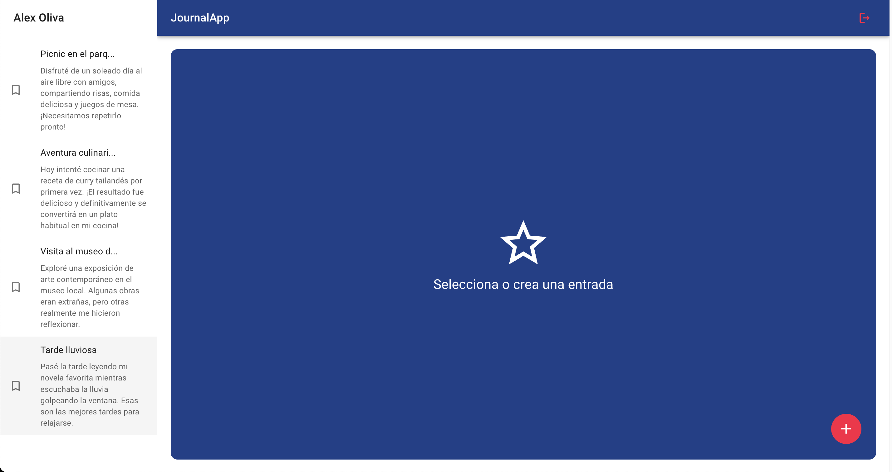
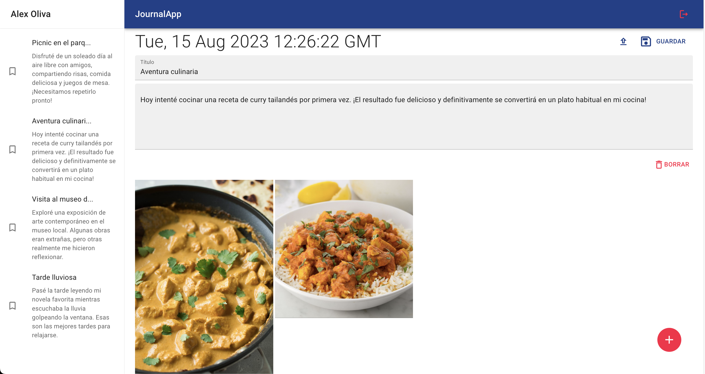

# NoteVerse - Tu Espacio Creativo de Notas y Recuerdos

Bienvenido a NoteVerse, la plataforma que te permite capturar y compartir tus momentos más significativos de manera única. Con NoteVerse, puedes llevar un diario digital enriquecido con descripciones, títulos, imágenes y fechas, creando una experiencia de narración personalizada para tus recuerdos.

## Características Principales

- **Notas Multiformato:** Crea entradas con textos descriptivos, títulos llamativos e imágenes que capturen la esencia de tus momentos.

- **Organización Intuitiva:** Etiqueta y categoriza tus notas para encontrarlas fácilmente cuando las necesites.

- **Explora en el Tiempo:** Navega por tus recuerdos utilizando nuestra línea de tiempo interactiva y revive tus momentos especiales.

- **Diseño Responsivo:** Disfruta de la misma experiencia fluida tanto en dispositivos móviles como en ordenadores de escritorio.

## Capturas de Pantalla





# Tecnologías FRONT-END utilizadas en este proyecto:


## Bundler


## Tecnologías BACK-END utilizadas en este proyecto:


## Librerías aplicadas en el proyecto:


## Testing:


## Otras herramientas utilizadas en el desarrollo


## Instalación

1. Clona este repositorio.

```bash
git clone https://github.com/Alex87464/Noteverse-JournalApp.git
```

2. Ejecuta `npm install` para instalar las dependencias.
3. Inicia la aplicación con `npm run dev` para la version de desarrollo.

## Contribución

¡Contribuciones son bienvenidas! Si encuentras algún error o tienes sugerencias para mejoras, por favor abre un issue o envía un pull request.

## Contacto

¿Preguntas o comentarios? Puedes contactarme en alexoliva.developer@gmail.com o visitar mi sitio web [www.alexoliva.work](https://www.alexoliva.work).
